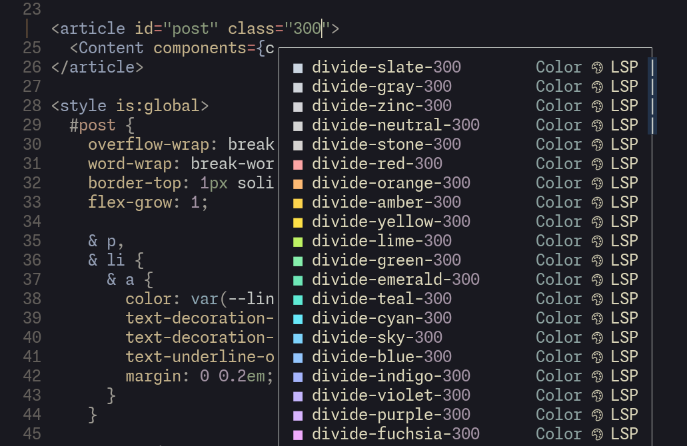

# ddc-filter-converter_color

Adds color preview to LSP completion items.

Any LSP that supports `textDocument/documentColor` will have color previews on completion items.



## Required

- [denops.vim](https://github.com/vim-denops/denops.vim)
- [ddc.vim](https://github.com/Shougo/ddc.vim)

## Configuration

```vim
call ddc#custom#patch_global(#{
    \   sourceOptions: #{
    \     lsp: #{
    \       converters: [ 'converter_color' ],
    \     },
    \   }
    \ })
```

## Note

This plugins is heavily inspired by [nvim-highlight-colors](https://github.com/brenoprata10/nvim-highlight-colors).
